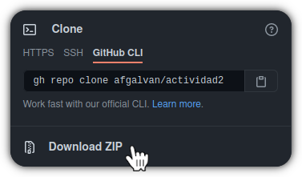

<h1 align="center">
    <span> [Subject] - Programación II.</span>
    <br />
    <div>
        [Description].
    </div>
</h1>

<p align="center">
    <a href="https://www.oracle.com/java/technologies/javase/javase-jdk8-downloads.html">
        
    </a>
    <a href="https://www.codacy.com/gh/afgalvan/actividad3/dashboard?utm_source=github.com&amp;utm_medium=referral&amp;utm_content=afgalvan/actividad3&amp;utm_campaign=Badge_Grade">
        
    </a>
</p>

<p align="center">
    [Purpose] <a href="./docs/questions.pdf">[Questions]</a>.
</p>

## Obtener el proyecto

### Descargar desde github.com




### Desde la línea de comandos

Asegurate de tener git instalado.

```bash
git --version
```

Clona el repositorio.

```bash
git clone <url>.git 
```
